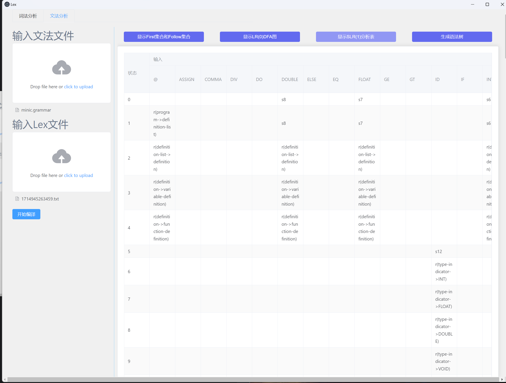

# 介绍
编译原理综合项目 

实现了：
1. 输入某一高级程序设计语言的所有单词对应的正则表达式，生成其对应的NFA,DFA,最小化的DFA和词法分析程序。
2. 利用第一步生成的词法分析程序，我们可以对其对应的高级语言源程序进行词法分析，生成词法序列Lex文件。
3. 输入某一高级程序设计语言的所有语法对应的文法，输出其对应文法的First集合，Follow集合，LR(0)DFA图，SLR(1)分析表。
4. 根据第二步生成的Lex文件和第三步生成的SLR(1)分析表，来生成Lex文件对应的语法树。
# 构建方式

```text
# 下载依赖，输出文件在node_modules目录
npm install
# 打包前端页面，输出文件在dist目录，注意：这里打包成功后要修改dist/index.html中css文件和js文件的路径为相对路径，也就是在前面加个.
npm run build
# 将electron打包为exe可执行程序，输出文件在app目录，启动程序为start.exe
npm run package-win
```
接着使用 `CMake` 编译后端 `cpp` 程序，生成 `main.exe` ，然后将 `main.exe` 复制到上面生成的 `app/start-win32-x64` 目录中就可以启动 `start.exe` 了。

# 演示
测试样例在test目录下
## tiny语言

### 词法分析
NFA图

合并后的DFA图

词法分析程序（可以通过点击 `保存当前显示code` 按钮来保存）

然后点击 `编译词法分析程序` 按钮就会在 `temp` 目录下生成 `lex.exe` 。
然后点击 `运行词法分析程序` 按钮来获取词法分析程序的运行结果（也可以通过点击 `保存当前显示code` 按钮来保存）


### 文法分析


## minic语言

### 词法分析


### 文法分析




